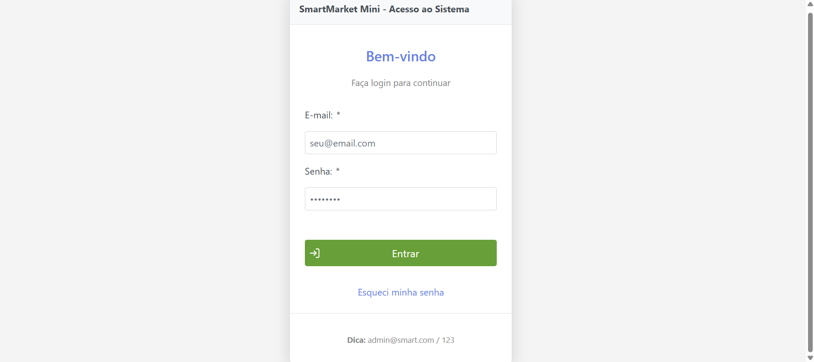
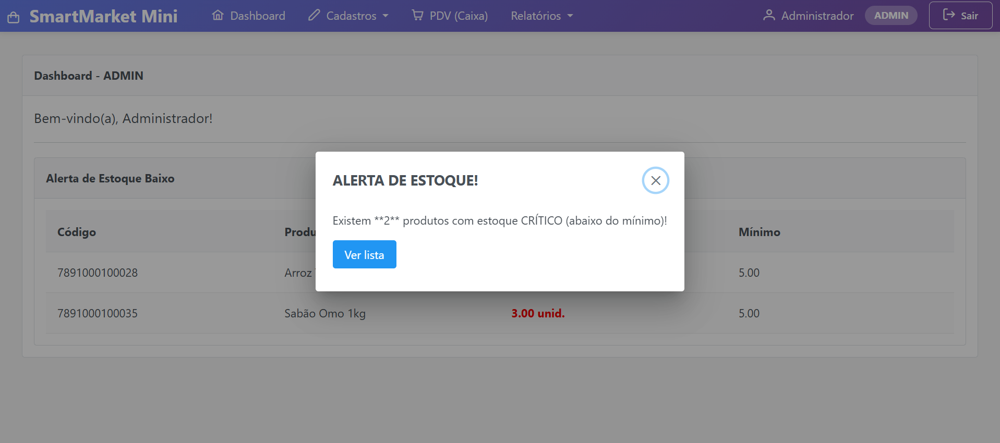
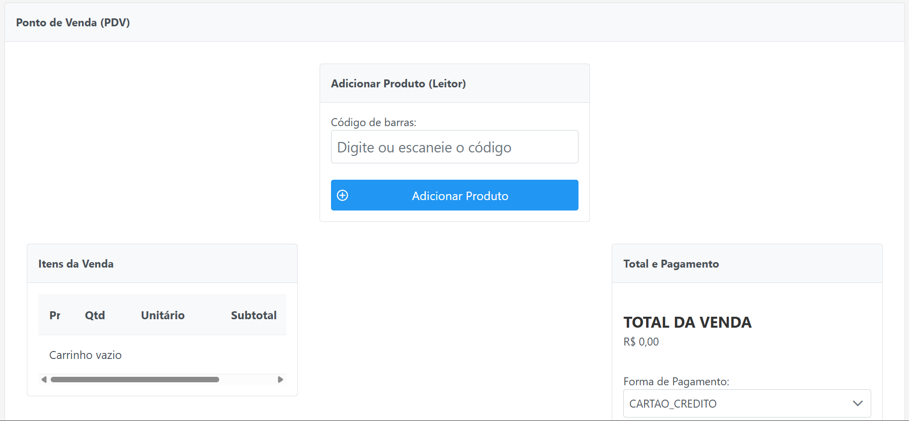
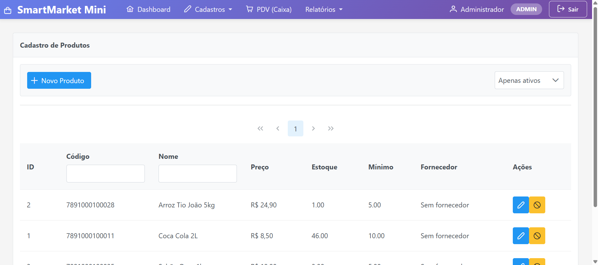
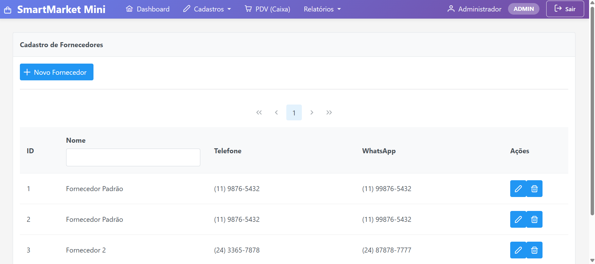
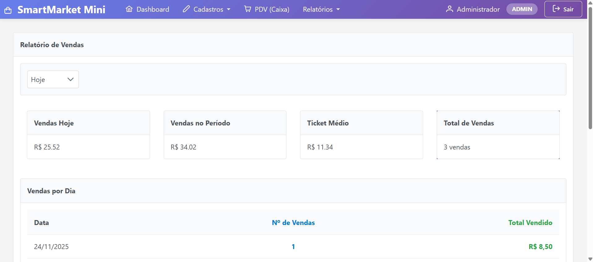

# SmartMarket - Sistema de Gestão de Varejo

Este projeto é um Sistema de Gestão de Varejo (ERP) desenvolvido com foco em usabilidade e eficiência para pequenos e médios negócios. O SmartMarket permite o gerenciamento completo de vendas, estoque, produtos, fornecedores e usuários, utilizando uma arquitetura robusta baseada em Java.

---

## 🚀 Funcionalidades Principais

O sistema cobre os processos essenciais de um ponto de venda e retaguarda:

- **Ponto de Venda (PDV):** Interface otimizada para registro rápido de vendas, com carrinho dinâmico e finalização de compra.  
- **Gestão de Produtos e Estoque:** Cadastro detalhado de produtos e monitoramento em tempo real dos níveis de estoque.  
- **Controle de Fornecedores:** Gerenciamento de informações de contato e produtos fornecidos.  
- **Controle de Usuários e Acesso:** Gerenciamento de usuários com diferentes perfis de acesso (Admin, Funcionário).  
- **Logs de Sistema:** Registro de atividades importantes no sistema (LogSistema).  
- **Relatórios:** Geração de relatórios de vendas e cupons fiscais em PDF.  
- **Dashboard:** Visão geral com indicadores e gráficos de desempenho de vendas.

---

## 🛠 Tecnologias Utilizadas

O projeto segue o padrão MVC (Model-View-Controller) e utiliza o ecossistema Java para o desenvolvimento:

| Categoria     | Tecnologia                 | Descrição                                           |
|--------------|---------------------------|---------------------------------------------------|
| Backend       | Java (Jakarta EE)          | Linguagem base e especificações para o servidor  |
|              | JPA / Hibernate            | Persistência de dados e mapeamento Objeto-Relacional |
|              | Maven                      | Gerenciamento de dependências e ciclo de vida do projeto |
|              | jBCrypt                    | Biblioteca para hashing de senhas                |
| Frontend      | JSF (Jakarta Server Faces) | Framework para construção da interface de usuário |
|              | PrimeFaces                 | Biblioteca de componentes visuais rica e responsiva |
| Infraestrutura| MySQL                      | Banco de dados relacional para armazenamento de dados |
|              | Tomcat                     | Servidor de aplicação web                        |
                   |

---

## 📸 Galeria do Sistema

Para ilustrar a interface e as principais telas do SmartMarket:

<!-- Tela de Login -->
<h3>Tela de Login</h3>

<!-- Dashboard: duas imagens lado a lado -->
<h3>Dashboard</h3>

  
  

<!-- Ponto de Venda -->
<h3>Ponto de Venda (PDV)</h3>

<!-- Gestão de Produtos/Estoque -->
<h3>Gestão de Produtos/Estoque</h3>

<!-- Gestão de Fornecedores -->
<h3>Gestão de Fornecedores</h3>

<!-- Relatório de Vendas -->
<h3>Relatório de Vendas</h3>

---

## ⚙️ Pré-requisitos

Para executar o projeto localmente, você precisará ter instalado:

- Java JDK 17+  
- Maven 3.6+  
- MySQL Server 8.0+  
- Git

---

## 💾 Configuração do Banco de Dados

1. **Crie o Schema:** No seu servidor MySQL, crie um banco de dados chamado `smartmarket` (ou o nome que preferir).  
2. **Configuração de Conexão:** O projeto utiliza o arquivo `persistence.xml` para a configuração do banco. Ajuste usuário e senha conforme sua instalação local.

---

## 🚀 Como Rodar o Projeto

1. **Clone o repositório:**  <https://github.com/Emmily05/erp-smartmarket.git>
2. **Compile e Empacote:** mvn clean package
2. **Deploy:** O arquivo .war gerado em target/ deve ser implantado em um servidor de aplicação compatível com Jakarta EE (como Apache Tomcat).

## 🧪 Observações sobre o MVP

Este projeto é uma **versão MVP (Minimum Viable Product)** do SmartMarket, ou seja, é funcional, mas ainda não possui todas as funcionalidades de cadastro de usuários.  

Para testar o sistema, você pode criar 3 usuários: 

| Usuário       | E-mail           | Senha |
|---------------|-----------------|-------|
| Administrador | admin@smart.com  | 123   |
| Maria Gerente | maria@smart.com  | 123   |
| João Caixa    | joao@smart.com   | 123   |

## 🔒 Melhorias Futuras

**Segurança de Senha Aprimorada:** Implementar Spring Security ou solução moderna de hashing.

**Rastreabilidade e Auditoria:** Expandir logs de segurança e sistema para facilitar auditoria e troubleshooting.

**Controle de Acesso Fino:** Implementar controle de acesso granular baseado em papéis e permissões.